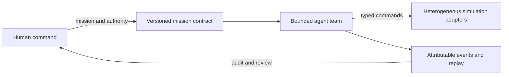

  <picture>
    <source
      media="(prefers-color-scheme: dark)"
      srcset="./[endr][assets][logos]/[endr][logo][black-background].png"
    >
    <source
      media="(prefers-color-scheme: light)"
      srcset="./[endr][assets][logos]/[endr][logo][white-background].png"
    >
    
  </picture>

<h1 align="center">endr</h1>

<strong>Mission autonomy, bounded by design.</strong>

  <a href="https://endrcompany.com">Website</a> ·
  <a href="https://github.com/orgs/endrcompany/repositories">Repositories</a> ·
  <a href="https://x.com/endrcompany">X</a> ·
  <a href="mailto:ezekiel@endrcompany.com">Contact</a>

---

`endr` is a research- and simulation-first defense-autonomy software company developing a vendor-neutral platform for building, training, validating, and eventually deploying bounded mission-autonomy agents across heterogeneous unmanned systems.

The platform is intended to translate human-authored mission intent into coordinated machine tasks, enforce explicit authority and policy limits, evaluate behavior under simulated communications degradation, and preserve attributable evidence for replay. `endr` builds software—not vehicles or weapons.

The long-term objective is portable agent software across ground, aerial, maritime, and space systems. Domain support will be claimed only after it is independently evidenced.

## What we're building

The company is testing a problem hypothesis: autonomy teams integrating unlike systems may have to rebuild mission planning, task allocation, degraded-network behavior, platform adapters, and evidence tooling for each new vehicle or program. `endr` is exploring whether a common, typed mission contract and constrained runtime can separate mission logic from platform-specific control while preserving human authority.

### Proposed simulation-first architecture

The planned stack uses Python for mission definition, agent development, scenarios, and evaluation, with Rust as the direction for resource-bounded execution, policy enforcement, peer coordination, and event capture. Typed adapters isolate mission logic from simulator and platform interfaces.

### First proof target

The first bounded experiment is a deterministic, unarmed, non-kinetic simulation with two to four agents that have different capabilities. It is intended to test:

- capability-aware task assignment and eligible reassignment;
- delayed, intermittent, or lost communications and one simulated platform failure;
- local policy and resource limits that remain in force during degradation;
- operator approval, pause, redirect, and abort controls;
- replay of why each task was assigned, changed, rejected, or stopped; and
- reproducible comparison with a simple scripted or centralized baseline.

## Governing requirements

These are design requirements, not current performance claims:

- Agents receive bounded authority; they do not invent mission authority.
- Humans retain authority over consequential decisions.
- Lost communications never enlarge machine authority.
- Invalid identity, policy, state, timing, or authorization must fail closed.
- Operationally relevant transitions must be attributable and replayable.
- Simulation and reproducible evidence precede hardware consideration.

## Current status

> **Legally formed company · active software development · mission platform in design**

endr is a legally formed limited liability company based in Seattle, Washington. It is actively developing mission-autonomy software products through a research- and simulation-first program. Legal formation is established; business, market, product, technical, safety, security, and operational maturity require separate evidence.

As reviewed on 2026-09-02, internal web software and repository tooling are implemented. Mission-platform architecture and MVP specifications exist, while mission-runtime implementation and reproducible mission-simulation evidence were not located in the inspected active sources. An illustrative topology animation is not a mission simulation. Governance and provenance approvals remain open.

`endr` distinguishes **planned**, **designed**, **prototyped**, **implemented**, **tested**, **simulated**, **hardware-tested**, **field-tested**, and **operationally validated** work. Those states are not interchangeable.

No fielded, certified, secure, resilient, combat-proven, or production-ready capability is claimed. Live vehicle control, field deployment, targeting, weapons integration, classified information, CUI, and autonomous expansion of mission scope are outside the current phase.

Older repositories in this organization may reflect superseded perception research. They are historical experiments, not the current product thesis or evidence of current platform capability.

## Non-confidential conversations

`endr` welcomes problem-focused conversations with autonomy and robotics engineers, applied research groups, and test-and-evaluation teams working on heterogeneous-system integration, degraded-network testing, or attributable autonomy behavior.

[Email us](mailto:ezekiel@endrcompany.com) if that describes your work and you can discuss it without controlled or confidential details. Please do not send classified information, CUI, export-controlled technical data, or employer, customer, government, or other third-party confidential material through public channels.
